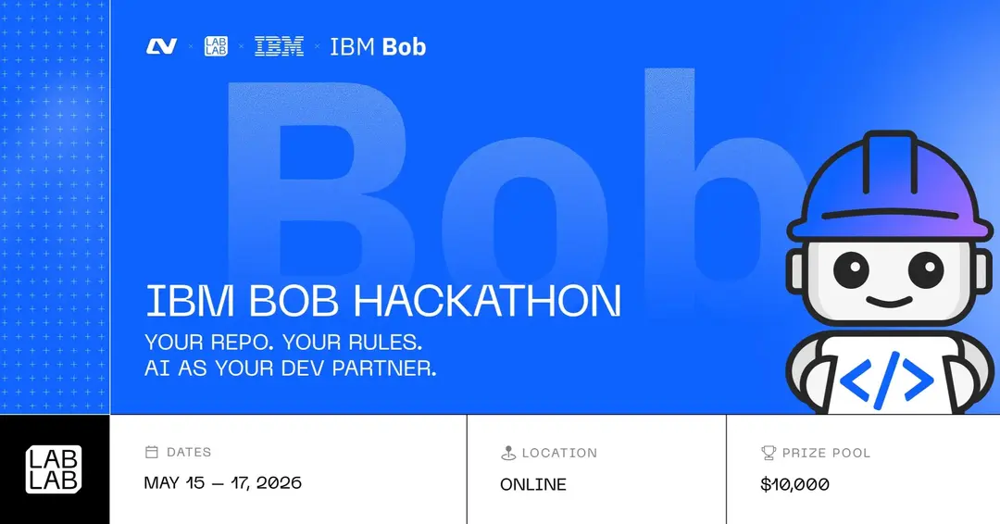

# Selune

Selune is a hands-off agentic development board for IBM Bob.

It turns project work into a live queue of tasks that Bob can claim, execute, update, and report back on. Instead of having to keep of multiple tasks and terminals, Selune gives you a bird's eye view of your project and lets you manage your workflow in one place.

## What It Does

- Organizes software work into boards, lanes, cards, checklists, and activity logs.
- Lets an IBM Bob agent poll for the next available task.
- Sends Bob a complete task prompt with repo path, task details, and reporting instructions.
- Tracks progress through todo updates, logs, completion status, and branch links.
- Moves finished work into review so a developer can inspect the result.

## Why Bob

Selune is built around IBM Bob as the active development partner. Bob works inside the real repository, uses the project context, performs the implementation, and reports progress back to Selune. The goal is a workflow where a developer defines intent once, then Bob handles the repetitive execution loop with visible state and reviewable output.

## Hackathon

Built for the IBM Bob Hackathon by lablab.ai.

Event: May 15-17, 2026, online  
Theme: Your repo. Your rules. AI as your dev partner.  
Challenge: Build solutions that improve how software is built with IBM Bob.

## Tech

Next.js, Supabase, Zustand and IBM Bob.
